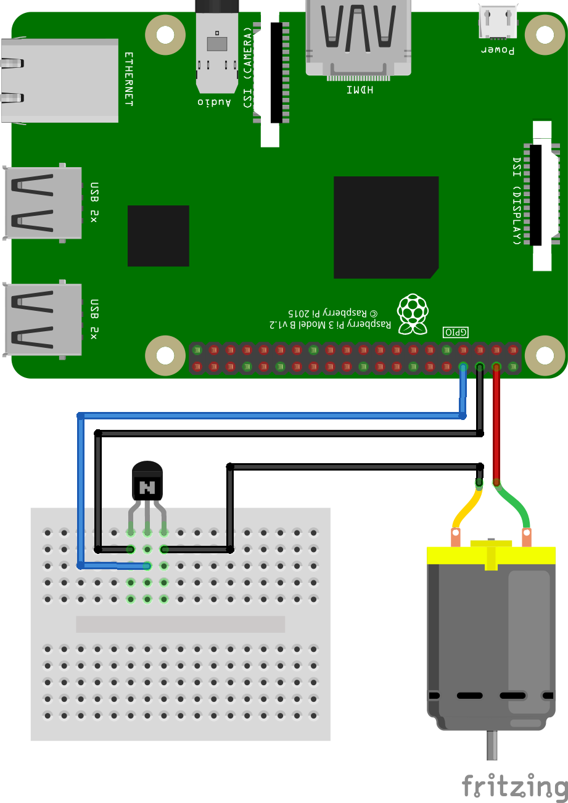
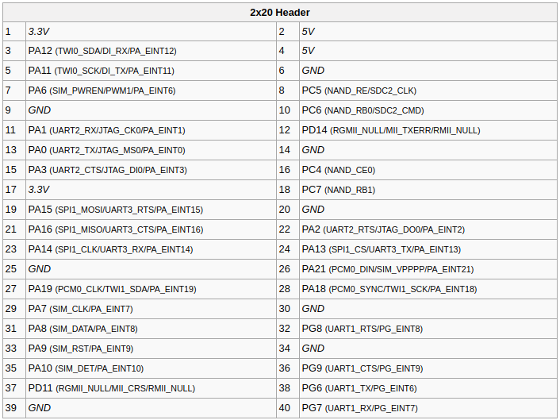

# Installation

### Hardware

You need 4 components:

* Orange Pi PC 2
* 5V fan
* Transistor 2N5551 or analog
* Some wires...

Scheme (see image):

1. Connect 5V pin on board to 5V pin on fan
2. Connect GND pin on board to left pin of transistor
3. Connect GPIO pin on board (e.g. 'PC5' in SUNXI pinout) to middle pin of transistor
4. Connect right pin on transistor to 0V pin on fan



##### SUNXI pinout



### Software

#### Run script

```bash
pip install requirements.txt
python fan_manager.py
```

#### Build image

```bash
docker build -t artrey/gpio-fan-manager .
```
